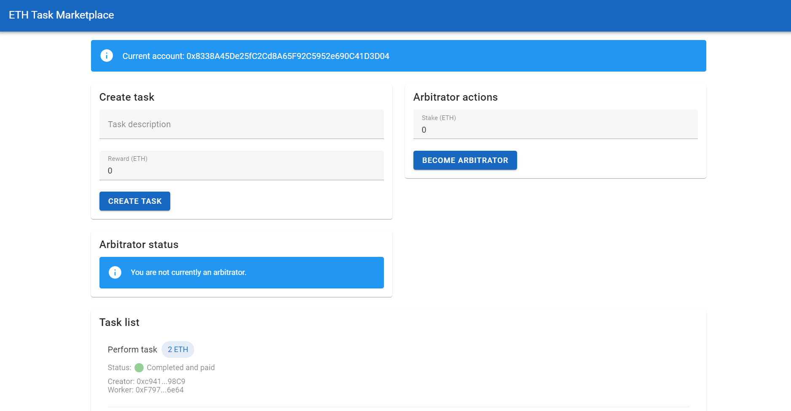
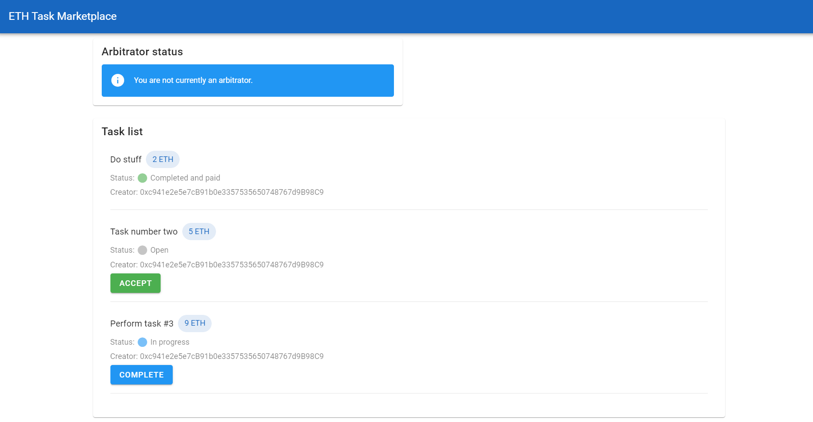
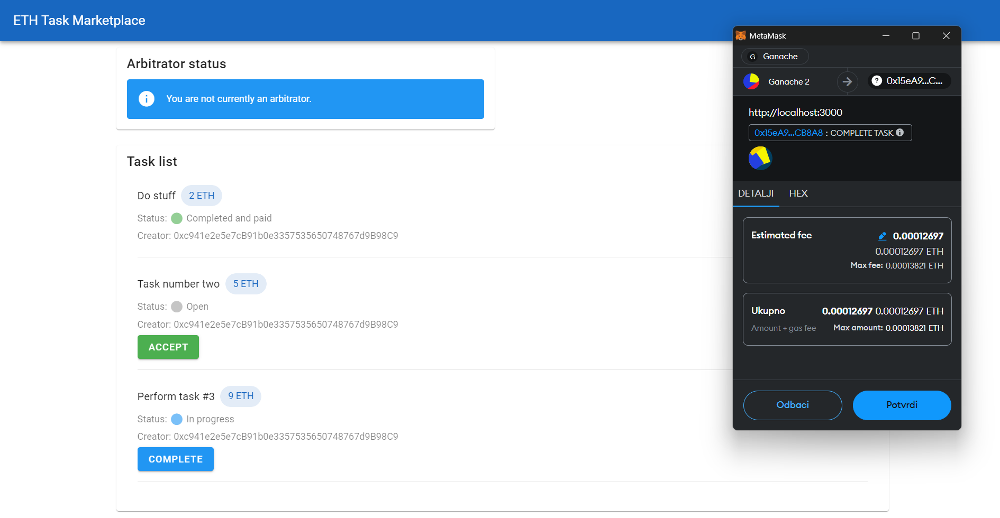
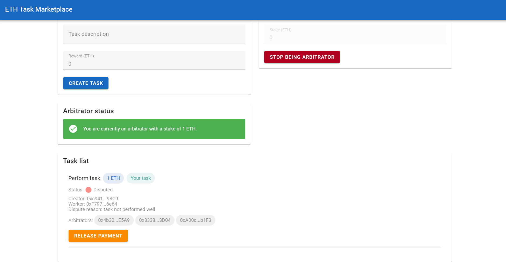
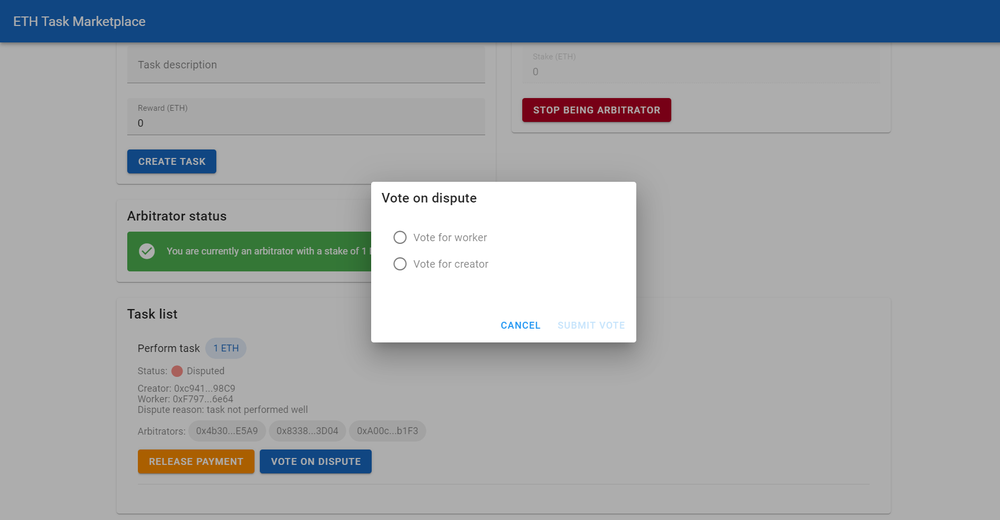

# ETH Task Marketplace

ETH Task Marketplace is a decentralized application (dApp) built on Ethereum that allows users to create, accept, and manage tasks with cryptocurrency rewards. The platform also includes a dispute resolution system with arbitrators.

## Features

* Create tasks with ETH rewards  
* Accept tasks and earn rewards  
* Complete tasks and release payments  
* Raise disputes for task completion  
* Become an arbitrator and vote on disputes  
* MetaMask integration for Ethereum transactions  

## Screenshots











## Tech stack

* Vue.js 3  
* Vuetify 3  
* web3.js  
* Solidity  
* Truffle (for smart contract development and deployment)  

## Setup and installation

1. Clone the repository:
   ```
   git clone https://github.com/jtlicardo/eth-task-marketplace.git
   ```
   ```
   cd eth-task-marketplace
   ```

2. Install dependencies:
   ```
   npm install
   ```

3. Start the development server:
   ```
   npm run dev
   ```

4. Open your browser and navigate to `http://localhost:3000`

## Smart contract deployment

1. Install Truffle globally:
   ```
   npm install -g truffle
   ```

2. Navigate to the Truffle project directory:
   ```
   cd src/truffle
   ```

3. Compile the smart contracts:
   ```
   truffle compile
   ```

4. Deploy the smart contracts to your chosen network:
   ```
   truffle migrate --network <network_name>
   ```
